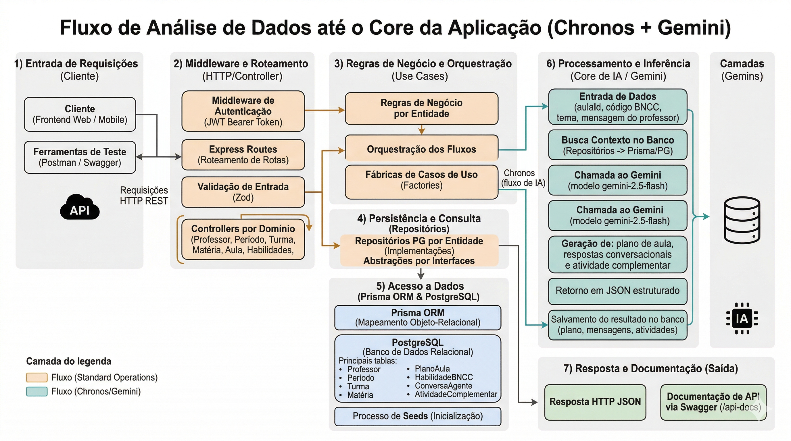

# Hackaton FIAP - Projeto

## Sumário
1. Membro do Grupo 25 
2. Definição do Projeto  
3. Requisitos Técnicos 
4. Requisitos Funcionais 
5. Fluxograma  
6. Prova de conceito
7. Configuração de ambiente
8. Estrutura da aplicação 
9. Processo de Desenvolvimento
10. Testes
11. Relatos dos Desafios Superados  
12. Entregas  
13. Conclusão

## Membros do grupo 25 
- Carlos Adriano - RM366258
- Cristhian Mendes - RM365590
- ⁠Gisele Cidral - RM366463
- ⁠Gustavo Rocha - RM365401

## Definição do projeto

O projeto visa a criação de uma ferramenta web voltada para professores, com o propósito de auxiliar na elaboração de planos de aula para o ambiente acadêmico. A ferramenta será estruturada com base nos pilares da Base Nacional Comum Curricular (BNCC), conforme as diretrizes nacionais do MEC.

## Requisitos técnicos

O projeto de desenvolvimento no segmento de back-end foi idealizado utilizando as seguintes tecnologias e ferramentas:

1. Node.js (TypeScript) para o desenvolvimento do back-end.
2. APIs REST desenvolvidas com o framework Express.
3. Banco de dados relacional PostgreSQL para persistência de dados.
4. Docker para gerenciamento de múltiplos ambientes de execução.
5. Swagger para documentação dos endpoints da API.
6. Prisma ORM para comunicação e gerenciamento do banco de dados.

## Requisitos funcionais

1. Entidade Professor
    - Login: Permitir que o professor acesse o sistema através de autenticação com email e senha.
    - Cadastro: Possibilitar que novos professores se registrem no sistema, fornecendo informações como nome, email, senha e disciplina(s) associada(s).
    - Buscar por ID: Recuperar os dados completos de um professor a partir do seu identificador único.
    - Deletar: Remover um professor do sistema, garantindo que todos os dados associados sejam tratados de acordo com regras de integridade.
    - Buscar por Email: Localizar um professor com base no seu endereço de email.
    - Buscar informações do usuário logado: Retornar os dados do professor atualmente autenticado, permitindo personalização da experiência.

2. Entidade Período
    - Buscar todos: Listar todos os períodos existentes no sistema, como manhã, tarde e noite, ou por semestre/ano letivo.
    - Cadastro: Criar um novo período, definindo informações como nome e datas de início e fim.
    - Buscar por ID: Recuperar detalhes de um período específico através do seu identificador único.
    - Deletar: Remover um período existente, garantindo integridade das turmas e aulas associadas.
    - Editar: Alterar informações de um período já cadastrado, como nome ou datas.

3. Entidade Turmas
    - Buscar todos: Listar todas as turmas registradas no sistema, incluindo informações de período e professores responsáveis.
    - Cadastro: Criar uma nova turma, informando período, disciplina e professor responsável.
    - Buscar por ID: Recuperar informações detalhadas de uma turma específica.
    - Deletar: Remover uma turma do sistema, cuidando para manter integridade dos dados relacionados às aulas e alunos.
    - Editar: Atualizar dados de uma turma existente, como nome, período ou professor responsável.

4. Entidade Matérias
    - Buscar todos: Listar todas as matérias disponíveis no sistema.
    - Cadastro: Cadastrar uma nova matéria, incluindo informações como nome, código e área de conhecimento.
    - Buscar por ID: Recuperar detalhes de uma matéria específica.
    - Deletar: Remover uma matéria do sistema, considerando impactos nas turmas e aulas associadas.
    - Editar: Atualizar informações de uma matéria existente.

5. Entidade Aulas
    - Buscar todos: Listar apenas as aulas vinculadas ao professor autenticado, incluindo informações de turma, matéria e professores relacionados.
    - Cadastro: Criar uma nova aula e vinculá-la automaticamente ao professor logado.
    - Buscar por ID: Recuperar informações completas de uma aula específica somente quando ela pertencer ao professor autenticado.
    - Deletar: Remover uma aula do sistema, respeitando o vínculo do professor autenticado com a aula.
    - Editar: Alterar informações de uma aula já cadastrada apenas quando a aula pertencer ao professor autenticado.

6. Entidade Planos de aulas
    - Cadastrar plano de aula: Gerar plano de aula com base nas habilidades BNCC e tema.
    - Listar planos de aulas: Buscar os planos de aula gerados pelo professor autenticado.
    - Escopo do plano: Cada plano é isolado por professor e aula.

7. Entidade AGENTE Chronos
    - Enviar mensagem: Enviar mensagem para o Agente Chronos e receber uma resposta do agente.
    - Buscar historico: Buscar histórico da conversa mais recente de uma aula específica ou de uma conversa específica via `conversaId`.
    - Gerar atividade: Gerar atividade complementar com IA baseada na BNCC.
    - Listar atividades: Listar atividades complementares do plano de aula do professor autenticado.
    - Múltiplas conversas: Permitir múltiplas conversas para a mesma aula do mesmo professor.
    - Persistência contextual: A geração de atividade também é registrada no histórico da conversa.

8. Entidade Habilidades BNCC
    - Habilidades BNCC: Obter filtros (materias e anos) para seleção da BNCC
    - Habilidades: Listar habilidades filtradas para seleção do professor.

## Configuração de ambiente

Recomenda-se que os pré-requisitos de instalação de tecnologia em seu ambiente de execução sejam os seguintes, listados abaixo. Após verificar as tecnologicas instaladas, siga o procedimento em seguida para inicializar o projeto.

- Node.js: v18.19.1
- Docker: 28.3.2
- Git: 2.43.0

1. Clonar o repositório disponível no GitHub através do link: https://github.com/MyNameIsGustavo/Hackaton_Backend_FIAP

2. Criar os arquivos `.env` e `.env.dev` na raiz do projeto.

3. Criar um arquivo ".gitignore" na raiz do projeto, incluindo: .env, .env.dev, .env.*, node_modules, dist e /src/generated/prisma

4. Instalar o docker desktop em seu ambiente local através da URL: https://docs.docker.com/desktop/setup/install/windows-install/

5. Para replicação completa do ambiente no qual foi desenvolvido o projeto, instale o WSL com a distribuição Ubuntu. Para mais instruções siga está documentação oficial distribuida pela Microsoft: https://learn.microsoft.com/pt-br/windows/wsl/install

6. Com o Docker configurado em seu ambiente e localizado dentro do diretório do projeto, utilize o comando abaixo para subir a aplicação localmente com build da imagem, aplicação das migrations e geração do Prisma Client:

```bash
docker compose --env-file .env.dev -f docker-compose.dev.yaml up -d --build
```

O container do backend executa automaticamente:

```bash
npx prisma migrate deploy && npx prisma generate && npm run dev
```

### Variáveis de ambiente obrigatórias

| Variável | Descrição |
|---|---|
| `NODE_ENV` | Ambiente da aplicação (`DESENVOLVIMENTO` ou `PRODUCAO`) |
| `PORT_APP` | Porta de execução da API |
| `DB_CONNECTION` | String de conexão PostgreSQL usada por Prisma/pg |
| `SECRET_KEY` | Chave secreta para assinatura/verificação de JWT |
| `BCRYPT_SALT_ROUNDS` | Fator de hash do bcrypt |
| `GEMINI_API_KEY` | Chave de API do Gemini para funcionalidades do Chronos |

### Rodando sem Docker (local)

```bash
npm install
npx prisma migrate deploy
npm run dev
```

Para build e execução em modo produção:

```bash
npm run build
npm start
```

## Fluxograma  

Esse diagrama detalha o funcionamento interno da aplicação Chronos, mostrando o caminho de uma requisição.

- Client/HTTP → Pode ser Postman, browser ou frontend, que inicia a requisição.
- Controller/HTTP → Camada que recebe a requisição, aplica middlewares e prepara a resposta.
- Aplica caso de uso → Onde a regra de negócio correspondente à requisição é acionada.
- Lógica de negócios → Coordena regras específicas e interações entre os repositórios.
- Persiste dados → Parte responsável por salvar ou atualizar informações no banco.
- Repositórios → Comunicação direta com o PostgreSQL e suporte via PgAdmin.

Além disso, o diagrama destaca as tecnologias/ferramentas usadas em cada etapa: Express, Swagger, Zod (camada de validação), JWT, Bcrypt (na lógica de autenticação), PostgreSQL e PgAdmin (persistência de dados).


## Prova de conceito

Conforme o descritivo do Hackathon da Pós-Tech em Full Stack Development, o desafio consiste em propor soluções práticas e inovadoras que melhorem o dia a dia de professores e professoras. Atendendo a esses requisitos, foi desenvolvida uma API que centraliza e automatiza o fluxo de trabalho docente, reduzindo tarefas manuais e otimizando o planejamento pedagógico.

A solução contempla entidades essenciais como Professor, Período, Turmas, Matérias e Aulas, permitindo desde a autenticação e gestão de professores até a organização completa do calendário acadêmico e das atividades em sala. Com isso, o professor consegue estruturar suas turmas, disciplinas e aulas de forma integrada e eficiente.

Como diferencial, a funcionalidade de Planos de Aula possibilita a geração automatizada de conteúdos com base na BNCC, enquanto o Agente Chronos utiliza inteligência artificial (Gemini - Google) para apoiar o professor com sugestões, geração de atividades e histórico contextualizado por aula.

Dessa forma, a proposta atende diretamente aos requisitos do hackathon ao oferecer uma solução unificada, prática e inovadora, que melhora a produtividade do professor e garante maior alinhamento pedagógico.

###  Requisitos técnicos

O projeto foi desenvolvido com base nos aprendizados ao longo da Pós-Tech em Full Stack Development, atendendo às diretrizes do hackathon por meio de uma arquitetura robusta, testável e escalável.

No back-end, a aplicação foi implementada utilizando Node.js com TypeScript. O servidor foi estruturado com o uso do Express para gerenciamento de rotas e middlewares, garantindo organização e clareza na definição dos endpoints.

Para persistência de dados, foi utilizado o banco relacional PostgreSQL, com uma instância em nuvem na Render para deploy e outra local para testes. A modelagem dos dados foi realizada de forma consistente com o uso do Prisma, assegurando integridade e facilidade na manipulação das entidades do sistema.

A aplicação foi containerizada com Docker, utilizando Dockerfile e Docker Compose, garantindo padronização de ambiente e facilidade de execução em diferentes contextos. A validação de dados foi realizada com o Zod, assegurando maior confiabilidade nas entradas da aplicação.

Por fim, o projeto também integra recursos de inteligência artificial com o uso do Gemini, reforçando a proposta inovadora do hackathon ao apoiar a geração de conteúdos pedagógicos de forma automatizada.

###  Requisitos funcionais

### Seeds

Para padronizar e facilitar a execução dos testes, foram criados seeds no banco de dados com dados iniciais essenciais para validação das funcionalidades do sistema. Esses seeds contemplam as principais entidades da aplicação:

- Usuários (professores)
- Períodos
- Turmas
- Matérias
- Habilidades BNCC
- Aulas

Essa abordagem garante um ambiente consistente para testes e validação das regras de negócio.
A documentação completa da API pode ser acessada via Swagger em:

- Local: `http://localhost:9090/api-docs`
- Produção: `https://hackaton-backend-fiap.onrender.com/api-docs`

### Autenticação

- O endpoint de login é `POST /login` e retorna um token JWT.
- Todos os demais endpoints protegidos exigem header: `Authorization: Bearer <token>`.

### Paginação e filtros (resumo)

- Entidades com listagem paginada usam parâmetros como `pagina` e `limite`.
- Alguns endpoints aceitam ordenação com `ordenaPor` e `ordem`.
- Habilidades BNCC aceitam filtros por `materia`/`materiaId` e `ano`/`anoEscolar`.

### Comandos úteis com Docker

Subir ambiente de desenvolvimento:

```bash
docker compose --env-file .env.dev -f docker-compose.dev.yaml up -d --build
```

Ver logs do backend:

```bash
docker compose --env-file .env.dev -f docker-compose.dev.yaml logs -f backend_hackaton
```

Ver logs do backend e do banco:

```bash
docker compose --env-file .env.dev -f docker-compose.dev.yaml logs -f backend_hackaton db_hackaton_dev
```

### Endpoints da entidade Aulas

- GET /aulas/{id} – Buscar aula por ID
Permite recuperar os detalhes completos de uma aula específica do professor autenticado.

- GET /aulas – Buscar todas as aulas
Retorna a listagem das aulas vinculadas ao professor autenticado.

- POST /aula – Cadastrar nova aula
Permite criar uma nova aula associando turma e matéria e vinculando automaticamente o professor autenticado.

- PUT /aula/{id} – Atualizar aula
Atualiza informações de uma aula existente do professor autenticado.

- DELETE /aula/{id} – Deletar aula por ID
Remove uma aula do professor autenticado.

### Endpoints de Planos de Aula

- POST /chronos/gerar-plano – Gerar plano de aula
Gera automaticamente um plano de aula com base na habilidade BNCC e no tema informado. O plano é isolado por professor e aula.

- GET /chronos/planos – Listar planos de aula
Retorna apenas os planos de aula do professor autenticado.

### Endpoints do Agente Chronos

- POST /chronos/conversar – Enviar mensagem para IA
Permite interação com o agente para suporte pedagógico. Aceita `aulaId`, `mensagem` e `conversaId` opcional para continuar uma conversa já existente.

- GET /chronos/conversar/{aulaId} – Histórico de conversa
Retorna o histórico da conversa mais recente da aula para o professor autenticado. Também aceita `conversaId` via query string para recuperar uma conversa específica.

- GET /chronos/conversas – Histórico completo do professor
Retorna todas as conversas do professor autenticado. Um mesmo professor pode ter múltiplas conversas para a mesma aula.

- POST /chronos/gerar-atividade – Gerar atividade complementar
Gera atividades com base na BNCC utilizando inteligência artificial. Se ainda não existir plano para aquela combinação de professor e aula, o backend gera um plano base antes de salvar a atividade. A atividade também é persistida no histórico da conversa.

- GET /chronos/atividades/{aulaId} – Listar atividades
Lista atividades complementares associadas ao plano de aula do professor autenticado para aquela aula.

### Observações importantes do Chronos

- Conversa, plano de aula e atividades são isolados por professor.
- O histórico de conversa é persistido em `ConversaAgente` e `MensagemAgente`.
- A geração de atividade cria mensagens no histórico da conversa além de salvar a atividade.
- Um professor pode abrir múltiplas conversas para a mesma aula.
- O frontend pode continuar o chat enviando `conversaId` para manter o contexto correto.

### Endpoints de Habilidades BNCC

- GET /habilidades/filtros – Obter filtros
Retorna opções de matérias e anos para seleção.

- GET /habilidades – Listar habilidades
Lista habilidades da BNCC com base nos filtros aplicados.

### Endpoints de Matérias

- GET /materias/{id} – Buscar matéria por ID

- GET /materias – Buscar todas as matérias

- POST /materia – Cadastrar nova matéria

- PUT /materia/{id} – Atualizar matéria

- DELETE /materia/{id} – Deletar matéria

### Endpoints de Períodos

- GET /periodos – Buscar todos os períodos

- GET /periodo/{id} – Buscar período por ID

- POST /periodo – Cadastrar período

- PUT /periodo/{id} – Atualizar período

- DELETE /periodo/{id} – Deletar período

### Endpoints de Professores

- POST /login – Autenticação do professor

- POST /professor/cadastro – Cadastro de professor

- GET /professor/{id} – Buscar professor por ID

- GET /professor/email/{email} – Buscar por email

- GET /professor – Dados do usuário logado

- DELETE /professor/{id} – Deletar professor

### Endpoints de Turmas

- GET /turmas/{id} – Buscar turma por ID

- GET /turmas – Buscar todas as turmas

- POST /turmas – Cadastrar turma

- PUT /turma/{id} – Atualizar turma

- DELETE /turma/{id} – Deletar turma

Dessa forma, os requisitos funcionais atendem integralmente à proposta do projeto, cobrindo desde a estruturação acadêmica até o uso de inteligência artificial no apoio ao professor, garantindo uma solução completa, integrada e validável.

## Estrutura da aplicação 

### Banco de dados - Modelo de Entidade-Relacionamento.

A seguir, é apresentado o Modelo de Entidade-Relacionamento (MER) do sistema, gerado por meio do Prisma Studio e estruturado a partir dos schemas definidos no Prisma. Esse modelo representa a base da arquitetura de dados da aplicação, descrevendo de forma clara as entidades, seus atributos e os relacionamentos existentes entre elas.

Além disso, o MER estabelece a organização e o fluxo das informações dentro do sistema, servindo como referência para a implementação das regras de negócio e garantindo consistência, integridade e escalabilidade dos dados ao longo do desenvolvimento realizado no hackathon.


### Fluxo de análise de dados até o core da aplicação (Gemini - Google).



### Estrutura da aplicação de desenvolvimento.

1. Entities
- Caminho: src/entities/
- Responsabilidade: Define de forma abstrata os atributos de cada entidade do sistema.

2. Interfaces
- Caminho: src/entities/interfaces/
- Responsabilidade: Definir contratos a serem honrados com bases nas entidades do sistema.

3. Controller/http
- Caminho: src/http/controller/
- Responsabilidade: Enviar e receber requisições HTTP, tratando apenas requisição e resposta e retornando o status code adequado.

4. lib/pg
- Caminho: src/lib/pg/
- Responsabilidade: Configurar e fornecer a conexão com o banco de dados PostgreSQL.

5. Middleware
- Caminho: src/middleware/
- Responsabilidade: Interceptar requisições para validações ou tratamentos específicos entre requisição e resposta.

6. Repositories
- Caminho: src/repositories/
- Responsabilidade: Persistência de dados no banco de dados, sem lógica de negócio.

7. Use-cases
- Caminho: src/useCases/
- Responsabilidade: Aplicar a lógica de negócio e coordenar interações entre camadas, utilizando Factory Pattern quando necessário.

8. index.ts
- Caminho: src/index.ts
- Responsabilidade: Arquivo de entrada da aplicação, inicializando banco, seeds, rotas e Swagger.

9. prismaClient.ts
- Responsabilidade: Arquivo de configuração do prisma com o banco de dados Postgres.

10. servidor.ts
- Responsabilidade: Configurar e iniciar o servidor HTTP utilizando Express.

11. Swagger.ts
- Caminho: src/swagger.ts
- Responsabilidade: Configurar o ambiente para utilização do Swagger.

12. prisma/schema.prisma
- Caminho: prisma/schema.prisma
- Responsabilidade: Definir modelos e tabelas do banco de dados PostgreSQL.

13. node_modules/
- Pasta: node_modules	
- Responsabilidade: Armazena bibliotecas externas

14. docker-compose.dev.yaml
- Arquivo: docker-compose.dev.yaml
- Responsabilidade: Orquestração de containers da aplicação de desenvolvimento

15. docker-compose.prod.yaml
- Arquivo: docker-compose.prod.yaml
- Responsabilidade: Orquestração de containers da aplicação de produção

16. dockerfile
- Arquivo: Dockerfile	
- Responsabilidade: Arquivo de entrada para container Docker

18. package.json
- Arquivo: package.json	
- Responsabilidade: Gerenciamento de dependências e scripts

19. package-lock.json
- Arquivo: package-lock.json	
- Responsabilidade: Registro das versões instaladas

20. tsconfig.json
- Arquivo: tsconfig.json	
- Responsabilidade: Configuração do TypeScript

## Processo de Desenvolvimento  

O desenvolvimento do projeto foi conduzido em etapas incrementais, iniciando pela modelagem das entidades e relacionamentos no PostgreSQL com Prisma. Com a base de dados definida, foi estruturada uma arquitetura em camadas separando responsabilidades entre controllers, casos de uso e repositórios, facilitando manutenção, evolução e organização do código.

Na camada HTTP, os endpoints REST foram implementados em Express com validação de entrada via Zod e proteção por JWT nos recursos autenticados. Essa combinação ajudou a garantir consistência de dados na entrada da API e controle de acesso para operações sensíveis.

Com os fluxos CRUD principais estabilizados (Professor, Período, Turma, Matéria e Aula), o módulo Chronos foi evoluído para integrar IA com Gemini, permitindo geração de plano de aula, conversa contextual por aula e geração de atividade complementar baseada em BNCC.

Para acelerar validação funcional e homologação, o projeto utiliza seeds para popular dados essenciais na inicialização da aplicação. Em paralelo, a documentação dos endpoints foi centralizada no Swagger, garantindo visibilidade dos contratos da API e facilitando integração com frontend e testes manuais.

Por fim, o projeto foi preparado para execução em ambiente local com Node.js e também via Docker Compose, mantendo padronização entre os ambientes de desenvolvimento e produção.

## Testes

Atualmente, o projeto não possui suíte de testes automatizados implementada. O script `npm test` ainda está como placeholder.

As validações de comportamento vêm sendo realizadas via:

- Swagger (`/api-docs`)
- Requisições manuais por cliente HTTP (Postman/Insomnia)
- Seeds para massa de dados inicial consistente

## Relatos dos Desafios Superados  

- Carlos Adriano - RM366258: 
- ⁠Gustavo Rocha - RM365401: 

Desde o início do desenvolvimento do projeto do hackathon da última fase da Pós-Tech da FIAP, enfrentei algumas situações inéditas, especialmente no contexto de trabalho em grupo para a construção de um MVP. Durante a minha graduação, não tive a oportunidade de participar de um projeto com essas características, o que tornou essa experiência ainda mais diferente.

A construção de um MVP envolve muito mais do que apenas o desenvolvimento de um software funcional. Trata-se de uma experiência completa, que inclui aspectos como usabilidade, resolução de problemas reais e geração de valor por meio da tecnologia. Esse processo contribuiu significativamente para o meu aprendizado ao longo da fase.

Em relação às tecnologias utilizadas, optamos por trabalhar exclusivamente com as stacks abordadas durante a Pós-Tech, como forma de consolidar o conhecimento adquirido. No back-end, foram utilizados Node.js, Docker e PostgreSQL. O resultado final do projeto trouxe grande satisfação para toda a equipe, uma vez que conseguimos entregar todas as funcionalidades inicialmente planejadas, além de incorporar novas features ao longo do desenvolvimento.

Por fim, outro ponto de destaque foi o aprendizado relacionado às regras de negócio. Até então, eu não havia tido um contato aprofundado com esse tipo de análise fora do ambiente acadêmico da Pós-Tech. Por isso, considero que esse foi um dos principais desafios superados durante toda a jornada.

## Entregas  
Como resultado do esforço de desenvolvimento e da aplicação das práticas consolidadas ao longo da Pós-Tech, o grupo realizou as seguintes entregas funcionais e arquiteturais para compor o MVP:

- Repositório de Código Estruturado: Código-fonte versionado e organizado seguindo princípios de separação de responsabilidades, facilitando a manutenção e a escalabilidade.

- API RESTful Funcional e Segura: Back-end desenvolvido em Node.js com TypeScript, contendo rotas protegidas por autenticação JWT e validação de dados de entrada rigorosa utilizando Zod.

- Integração com Inteligência Artificial (Agente Chronos): Implementação completa do fluxo de comunicação com a API do Google Gemini, entregando geração de planos de aula automatizados, histórico de conversas contextualizado e criação de atividades baseadas nas diretrizes da BNCC.

- Documentação Interativa (Swagger): Mapeamento detalhado de todos os endpoints, parâmetros e respostas esperadas, disponível tanto no ambiente de desenvolvimento local quanto em produção, garantindo um contrato claro para a integração com o front-end.

- Infraestrutura Containerizada: Configuração completa com Docker e Docker Compose, garantindo a paridade entre os ambientes de desenvolvimento e produção, com orquestração simplificada do banco de dados e da aplicação.

- Modelagem de Dados e Persistência: Banco de dados PostgreSQL estruturado e gerenciado via Prisma ORM, acompanhado de Seeds para popular a base com dados iniciais (professores, matérias, habilidades BNCC, turmas), otimizando o processo de testes e validação.

- Deploy em Nuvem: Disponibilização da aplicação e do banco de dados na plataforma Render, permitindo o consumo real da API e a demonstração prática da prova de conceito do Hackathon.

## Conclusão
O desenvolvimento deste projeto para o Hackathon da FIAP representou a consolidação prática de todo o conhecimento técnico e analítico adquirido durante a Pós-Tech em Full Stack Development. O desafio de criar uma ferramenta que impactasse positivamente o dia a dia dos professores foi atendido através da construção de um Produto Mínimo Viável (MVP) robusto, focado em resolver dores reais do ambiente educacional: o tempo gasto no planejamento de aulas e a complexidade do alinhamento com a Base Nacional Comum Curricular (BNCC).

Sob a perspectiva técnica, a escolha de tecnologias como Node.js, TypeScript e PostgreSQL, aliada a ferramentas de infraestrutura como Docker, permitiu a construção de uma base sólida. A arquitetura foi desenhada com uma clara separação de responsabilidades (camadas de HTTP, Casos de Uso e Repositórios), o que não apenas garante a escalabilidade do sistema, mas também reflete boas práticas de engenharia de software necessárias para aplicações modernas.

O grande diferencial tecnológico da solução entregue é o Agente Chronos. A integração com modelos de IA generativa (Google Gemini) elevou a aplicação de um simples sistema de gestão acadêmica (CRUDs) para uma verdadeira plataforma de assistência pedagógica. A capacidade de manter o contexto das conversas, gerar planos de aula e atividades complementares isoladas por professor e turma demonstra um uso maduro da inteligência artificial para otimizar fluxos de trabalho humanos.

Por fim, a execução deste projeto superou o desafio técnico de codificação, exigindo da equipe o entendimento de regras de negócio específicas da área da educação, trabalho colaborativo eficiente e decisões arquiteturais estratégicas. O resultado é uma API completa, bem documentada e pronta para evolução, provando que o uso de tecnologia e inteligência artificial tem o potencial de transformar a gestão educacional, permitindo que os docentes foquem naquilo que mais importa: o ensino.